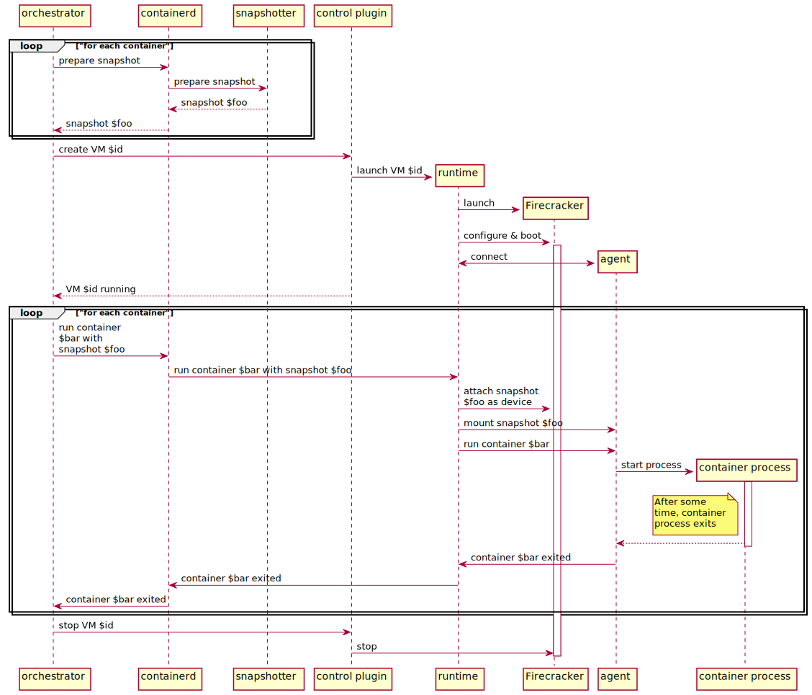

# firecracker-containerd architecture

firecracker-containerd aims to make it easier to run containers with virtual
machine isolation provided by the [Firecracker virtual machine monitor
(VMM)](https://github.com/firecracker-microvm/firecracker).
firecracker-containerd integrates with [containerd](https://containerd.io) by
implementing its interfaces and extending its APIs.

firecracker-containerd implements the following containerd interfaces:

* [snapshotter](https://github.com/containerd/containerd/blob/v1.2.6/snapshots/snapshotter.go#L116-L323):
  Snapshotters provide the implementation of layer storage and union filesystems
  for containerd containers
* [V2 runtime](https://github.com/containerd/containerd/blob/v1.2.6/runtime/v2/task/shim.proto):
  Runtimes provide the implementation for configuring and running containerized
  processes.  The V2 runtime is a containerd-specific interface and is not
  standardized as part of the [Open Containers Initiative
  (OCI)](https://www.opencontainers.org/).

firecracker-containerd also adds a new API, which we call the "control" API,
intended to model the lifecycle of a Firecracker microVM that can run multiple
containers.

This repository contains the components that implement those interfaces and
APIs.

There are currently several components in this repository:

* Two [snapshotter](../snapshotter)s
  that create files used as block-devices for pass-through into the
  microVM.  These snapshotters are used for providing the container image
  to the microVM.  Both snapshotters run as out-of-process gRPC proxy plugins.
  The [naive](../snapshotter/cmd/naive/README.md) snapshotter is a simple
  proof-of-concept using flat files and copy-ahead; it is useful for debugging
  and validating, and requires no setup.  The
  [devmapper](../snapshotter/cmd/devmapper/README.md) snapshotter leverages the
  [Linux device mapper](https://en.wikipedia.org/wiki/Device_mapper) framework
  and [thin
  provisioning](https://www.kernel.org/doc/Documentation/device-mapper/thin-provisioning.txt)
  to deduplicate storage between layers and enable copy-on-write functionality.
  The devmapper snapshotter has been [contributed to
  containerd](https://github.com/containerd/containerd/pull/3022), and we expect
  to remove the devmapper snapshotter source code from this repository in the
  future.
* A [control plugin](../firecracker-control) managing the lifecycle of the
  runtime and implementing our [control API](../proto/firecracker.proto) by
  proxying commands to the runtime.  The control plugin is compiled in to the
  containerd binary, which requires us to build a specialized containerd binary
  for firecracker-containerd.
* A [runtime](../runtime) implementing both the control API and the V2 runtime
  API.  The runtime links containerd (outside the microVM) to the Firecracker
  virtual machine monitor (VMM) for VM lifecycle operations and to the agent
  running inside the microVM for container lifecycle operations.  The runtime is
  implemented as an out-of-process [shim](https://github.com/containerd/containerd/issues/2426)
  communicating over ttrpc.
* An [agent](../agent) running inside the microVM, which is responsible for
  acting on control instructions received from the runtime, for emitting event
  and metric information to the runtime, and for proxying STDIO for the
  container processes.  The agent invokes [runC](https://runc.io) via
  containerd's `containerd-shim-runc-v1` to create standard Linux containers
  inside the microVM.
  
A high-level diagram of the various components and their interactions can be
seen below:

A high-level diagram of how the components interact for starting a container can
be seen below:

* Overview of possible design approaches can be found in the [design approaches
  doc](design-approaches.md).
* More details on the architecture of the shims and design decisions behind
  them can be found in the [shim design doc](shim-design.md).