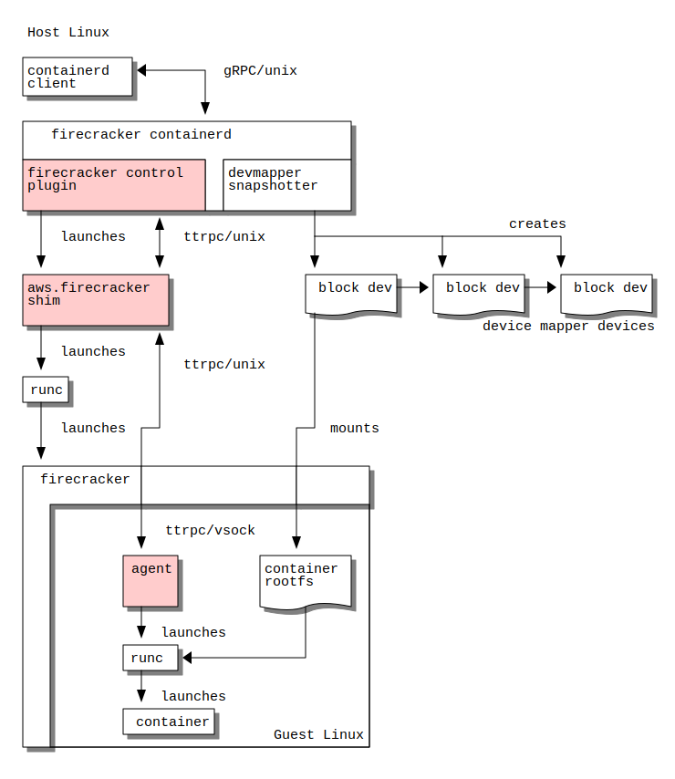

# firecracker-containerd architecture

firecracker-containerd aims to make it easier to run containers with virtual
machine isolation provided by the [Firecracker virtual machine monitor
(VMM)](https://github.com/firecracker-microvm/firecracker).

firecracker-containerd extends [containerd](https://containerd.io) by
adding `firecracker-control` plugin and `aws.firecracker` runtime shim. The runtime shim is launching Firecracker with firecracker-containerd's custom Linux image, that launches `agent` in the guest Linux's userspace. The agent is taking requests from the runtime shim and launches containers through runc.

A high-level diagram of the various components and their interactions can be seen below. The highlighted components are developled by ourselves and reside in this repository.

## firecracker-control plugin

[firecracker-control](../firecracker-control) plugin is managing the lifecycle of the runtime and implementing our [control API](../proto/firecracker.proto) intended to model the lifecycle of a Firecracker microVM. A microVM can run multiple containers together.

The control plugin is compiled in to the containerd binary, which requires us to build a specialized containerd binary as `firecracker-containerd`.

## aws.firecracker runtime shim.

[aws.firecracker runtime shim](../runtime) is implementing both the control API and the V2 runtime API.  The runtime links containerd (outside the microVM) to the Firecracker virtual machine monitor (VMM) for VM lifecycle operations and to the agent running inside the microVM for container lifecycle operations.

The runtime is implemented as an out-of-process [shim](https://github.com/containerd/containerd/issues/2426) communicating over ttrpc.

Note that the V2 runtime is a containerd-specific interface and is not standardized as part of the [Open Containers Initiative (OCI)](https://www.opencontainers.org/).

## Linux filesystem image

This repository has Debian-based Linux filesystem image that runs containers inside Firecracker. The image is designed to run inside Firecracker.

firecracker-containerd's in-VM [agent](../agent) is running inside the microVM, which is responsible for acting on control instructions received from the runtime, for emitting event and metric information to the runtime, and for proxying STDIO for the container processes.  The agent invokes [runC](https://runc.io) via containerd's `containerd-shim-runc-v1` to create standard Linux containers inside the microVM.

## Launch Sequence

A high-level diagram of how the components interact for starting a container can
be seen below:

## See Also

* Overview of possible design approaches can be found in the [design approaches
  doc](design-approaches.md).
* More details on the architecture of the shims and design decisions behind
  them can be found in the [shim design doc](shim-design.md).
