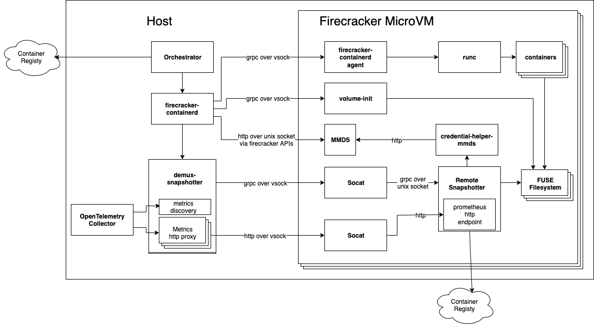
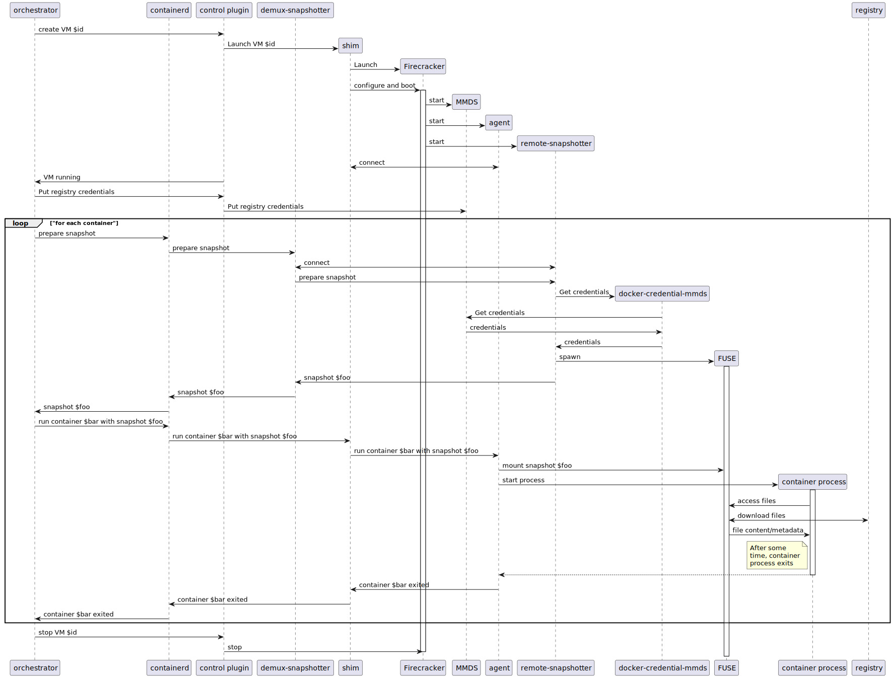

This document is about the architecture used to support remote snapshotters in firecracker-containerd. If you would like to jump in and launch eStargz images on firecracker-containerd, see the [remote snapshotter getting started guide.](remote-snapshotter-getting-started.md)

# Remote snapshotters overview

Remote snapshotters are a type of [containerd snapshotter](https://github.com/containerd/containerd/blob/ff91434af1b937a31cd3f76c31d079b74a11d9d0/docs/snapshotters/README.md) that are responsible for fetching snapshots from a remote location. When pulling an image with a normal snapshotter, the snapshotter provides mount points, but the containerd client pulls image layers into the containerd content store and unpacks them onto those mount points. With remote snapshotters, the snapshotter is responsible for providing mount points as well as pulling image layers and populating that snapshot. This allows remote snapshotters such as the [stargz-snapshotter](https://github.com/containerd/stargz-snapshotter) to lazily load snapshot content on-demand, thus reducing the upfront time needed for image pull. For more details see [containerd's remote snapshotter documentation](https://github.com/containerd/containerd/blob/v1.6.6/docs/remote-snapshotter.md).

There are several non-core containerd remote snapshotter projects which implement lazy loading via various mechanisms.
* [stargz-snapshotter](https://github.com/containerd/stargz-snapshotter) uses a custom [eStargz image format](https://github.com/containerd/stargz-snapshotter/blob/v0.12.0/docs/estargz.md) and exposes the lazily loaded image as a FUSE filesystem
* [nydus-snapshotter](https://github.com/containerd/nydus-snapshotter/) uses a custom [RAFS image format](https://github.com/dragonflyoss/image-service/blob/v2.0.1/docs/nydus-design.md#2-rafs) and exposes the lazily loaded image as either FUSE or virtio-fs.
* [overlaybd-snapshotter](https://github.com/containerd/accelerated-container-image) uses a custom [overlaybd image format](https://www.usenix.org/conference/atc20/presentation/li-huiba) and exposes the lazily loaded image as either a filesystem or a virtual block device.

# Remote snapshotters in firecracker-containerd

With the exception of overlaybd-snapshotter, each of these remote snapshotters expose the container mount points as a filesystem. This is a problem for firecracker-containerd because [Firecracker does not support virtio-fs](https://github.com/firecracker-microvm/firecracker/pull/1351#issuecomment-667085798), which means there is no direct way to expose these filesystems inside a microVM. 

Rather than add another layer of indirection in the form of a network filesystem, we opted to move the whole snapshotter inside the microVM. The lazy loaded filesystem exists only within the guest and can be mounted as a container rootfs from inside the microVM.

With this change, we run 1 remote snapshotter per microVM. Some infrastructure is needed in firecracker-containerd to expose these dynamically spawned snapshotters to containerd as well as proxy snapshotter requests across the VM boundary. This architecture is shown below.

# Architecture

## Definitions
* __Orchestrator__ - A firecracker-containerd client implementation
* __firecracker-containerd__ - The firecracker-containerd daemon comprised of the vanilla containerd API as well as the Firecracker control API
* __demux-snapshotter__ - A proxy snapshotter that receives snapshot requests from containerd and proxies them to a remote snapshotter running inside a specific microVM
* __firecracker-containerd agent__ - The guest side daemon that manages containers inside a microVM. This component is essentially a containerd shim that implements the Task API.
* __volume-init__ - A process for mounting volumes
* __MMDS__ - The Firecracker [microVM metadata store](https://github.com/firecracker-microvm/firecracker/blob/v1.1.0/docs/mmds/mmds-user-guide.md). It is an HTTP service inside the microVM that provides host-supplied metadata similar to [IMDS in EC2](https://docs.aws.amazon.com/AWSEC2/latest/UserGuide/ec2-instance-metadata.html).
* __credential-helper-mmds__ - A [Docker credential helper](https://github.com/docker/docker-credential-helpers) that can read credentials from MMDS. Remote snapshotters that support the Docker credential helper pattern can use this tool to retrieve the credentials needed to pull from the remote registry.
* __socat__ - [A multipurpose relay](http://www.dest-unreach.org/socat/). It is used to expose unix sockets inside the microVM as vsock services that can be reached from the host.
* __remote snapshotter__ - The snapshotter that is responsible for lazy loading container images

## New components

At a high level, this architecture adds 4 components:
1) A remote snapshotter inside the Firecracker rootfs that launches at boot 
1) Socat to expose the remote snapshotter's socket over vsock
1) A [demux-snapshotter](https://github.com/firecracker-microvm/firecracker-containerd/blob/913ab8bfc13d4735f3cd62dc6ac5f65e80db4400/snapshotter/README.md) which exposes itself as a single snapshotter to containerd, but proxies snapshot requests to the in-VM remote snapshotters
1) [docker-credential-helper-mmds](https://github.com/firecracker-microvm/firecracker-containerd/blob/913ab8bfc13d4735f3cd62dc6ac5f65e80db4400/docker-credential-mmds) to expose Firecracker's MMDS via the credential helper interface

## Credentials

Each remote snapshotter has its own mechanism for retrieving registry credentials. Many involve reading directly from a file on disk which is not very user-friendly in the firecracker-containerd case where that file would either need to be baked into the readonly rootfs or attached to the microVM as a block device. 

Instead, this architecture assumes the remote snapshotter can use the [Docker credential helper interface](https://github.com/docker/docker-credential-helpers). We provide a credential helper that can read credentials from MMDS which can be baked in to the rootfs. At runtime, the orchestrator places the correct credentials into MMDS via the firecracker control APIs and the remote snapshotter is able to read them with the helper. 

For more details on the specifics, see the [docker-credential-helper-mmds documentation](https://github.com/firecracker-microvm/firecracker-containerd/blob/913ab8bfc13d4735f3cd62dc6ac5f65e80db4400/docker-credential-mmds/README.md)

## Metrics

For remote snapshotters that expose metrics via [Prometheus](https://prometheus.io/), the demux-snapshotter provides APIs for discovering and scraping each remote snapshotter running inside the microVM. 

The demux-snapshotter provides 2 components for this:
1) A Prometheus [http service discovery API](https://prometheus.io/) that returns an http endpoint for each remote snapshotter that can be scraped to pull that snapshotter's metrics
2) An http proxy service for each remote snapshotter to proxy the HTTP request over the microVM's vsock to the remote snapshotter.

For more details, see the [metrics configuration for the demux-snapshotter](https://github.com/firecracker-microvm/firecracker-containerd/tree/main/snapshotter#metrics).

# Lazily loaded container sequence diagram
A high level diagram for the container launch sequence when using remote snapshotters is shown below. Notably, as compared to the [launch sequence when using devmapper](architecture.md), the microVM is launched before preparing container snapshots. 

