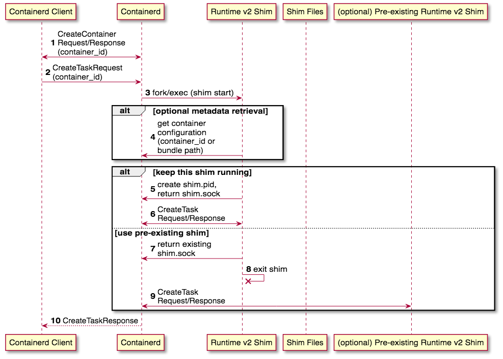
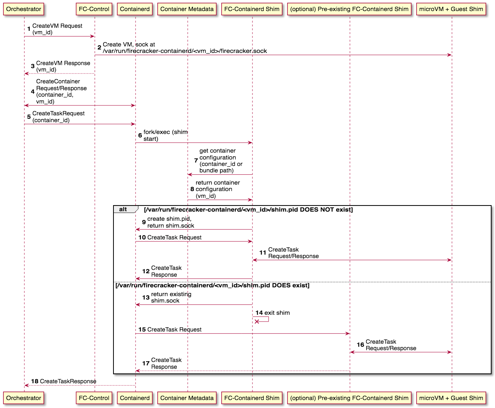

# Host+Guest Shim Behavior
- [Background](#background)
    - [The Problem](#the-problem)
    - [Terminology](#terminology)
    - [Containerd Runtime v2 Essentials](#containerd-runtime-v2-essentials)
- [Requirements](#requirements)
- [Decisions to be Made](#decisions-to-be-made)
    - [Out of scope](#out-of-scope)
- [Decision 1 - How Many Host Shims?](#decision-1---how-many-host-shims)
    - [Assumptions](#assumptions)
    - [Considerations](#considerations)
    - [Options](#options)
        - [1 For All VMs](#1-for-all-vms)
        - [(Preferred) 1 Per-VM](#preferred-1-per-vm)
        - [1 Per-Container](#1-per-container)
    - [Conclusion](#conclusion)
- [Decision 2 - How Many Guest Shims?](#decision-2---how-many-guest-shims)
    - [Considerations](#considerations)
    - [Options](#options)
        - [(Preferred) 1-For-All](#preferred-1-for-all)
        - [1-Per-Container](#1-per-container)
    - [Conclusion](#conclusion)
- [Summary](#summary)
    - [Integrated Solution](#integrated-solution)
        - [Exec](#exec)
        - [Case Without Pre-Created VM](#case-without-pre-created-vm)

# Background

## The Problem

Containerd's runtime v2 model gives runtime shims the flexibility to choose how many shim processes they want to run; there can be a 1-to-1 mapping between shim processes and tasks, 1 shim for all tasks, 1 shim for each exec, or anything in between.

Firecracker-containerd's use case calls for grouping of containers into different microVMs, so we can additionally decide not only how we want to map shim processes to running tasks, but also how we want to map shim processes to VMs.

The purpose of this doc is to determine which model best fits our use case in terms of complexity and security.

## Terminology

* **Host Shim (aka FC Runtime)**
    * A process running on the host (i.e. not inside a microVM) that manages firecracker-containerd's interaction with one or more VMs, including forwarding of requests to processes running inside the microVM and management of i/o streams coming out of the microVM
* **Guest Shim (aka Internal FC Agent)**
    * A process running inside a microVM that manages firecracker-containerd's activities inside the VM, including spawning of containers based on requests coming from the Host Shim and forwarding of i/o streams from the VM to the Host Shim
* **FC-Control**
    * A custom containerd GRPC plugin used to handle microVM specific APIs that do not have existing containerd API equivalents (i.e. StartVM).
    * The details of this plugin are *mostly* out of scope for this doc, but it is touched on in a few places where necessary
* **vm_id**
    * A unique identifier associated with each firecracker microVM that's used to reference which VM a given container is intended to run in.
        * In practice, there will likely be a 1-to-1 mapping between each ECS task or each EKS Pod to a `vm_id`.
* (containerd) **Container**
    * In containerd, a “[Container](https://github.com/containerd/containerd/blob/main/api/services/containers/v1/containers.proto#L38)” refers not to a running container but the metadata configuring a container.
* (containerd) **Task**
    * In containerd, a “[Task](https://github.com/containerd/containerd/blob/main/api/services/tasks/v1/tasks.proto#L56)” (not to be confused with an ECS Task), essentially refers to a running container; it is a running process using the configuration as specified in a previously defined Container object
* **“shim start” routine**
    * In the runtime v2 model, when containerd starts a new Task, it will always invoke the runtime binary specified in the Container object and run its “shim start” routine. This is the point where the runtime shim will decide whether it should keep running or if containerd should instead use a different, pre-existing shim process.
    * [Our current shim start routine is here.](https://github.com/firecracker-microvm/firecracker-containerd/blob/3f204844eed9b70f25e062f3a947dda582809757/runtime/service.go#L106)
    * This is discussed more in the following section.
* **“shim.pid”** and **“shim.sock”**
    * Though it's not strictly required, containerd gives support for shims to store their pid and which abstract unix address they are serving on in files. This supports shims that want to return a pre-existing shim process during their “shim start” routine.
    * [Our current shim does this here, using util functions provided by containerd.](https://github.com/firecracker-microvm/firecracker-containerd/blob/3f204844eed9b70f25e062f3a947dda582809757/runtime/service.go#L145)

## Containerd Runtime v2 Essentials

There's a few details of containerd's runtime v2 model that are essential to understand before diving into how it can fit into our use case. [The runtime v2 docs](https://github.com/containerd/containerd/blob/main/runtime/v2/README.md) and their [getting started guide](https://github.com/containerd/containerd/blob/main/docs/getting-started.md) have more details, but the important parts of the typical flow in creating a container within the runtime v2 model are summarized below:

1. The client makes a [CreateContainerRequest](https://github.com/containerd/containerd/blob/main/api/services/containers/v1/containers.proto#L38), which includes metadata for the intended container configuration (i.e. OCI runtime spec), which runtime the container should be spawned with (i.e. `aws.firecracker`) and a unique `container_id`
    1. This stores the metadata for the container definition within containerd, **but it does not actually spawn the container yet**
2. The client now wants to actually create a running task for the container it just defined, which it does by issuing a [CreateTaskRequest](https://github.com/containerd/containerd/blob/main/api/services/tasks/v1/tasks.proto#L56) that includes the `container_id` provided in the previous `CreateContainerRequest`
3. Containerd will now always `fork/exec` to the runtime's shim binary and invoke the “start” routine. **The shim is expected to [“either start a new shim or return an address to an existing shim based on the shim's logic.”](https://github.com/containerd/containerd/blob/main/runtime/v2/README.md#start)**
    1. (code) [containerd starting the shim binary](https://github.com/containerd/containerd/blob/9b882c44f8834613e53fc11045c10397a7d94e61/runtime/v2/manager.go#L126)
4. At this point, the shim can optionally retrieve some more metadata if needed to make a decision on how to proceed. It has a few IDs/paths available to it that can be used to retrieve that metadata:
    1. The `container_id` for the container that is going to be spawned into a running task. The `container_id` is the “id” field in [our shim's NewService func](https://github.com/firecracker-microvm/firecracker-containerd/blob/3f204844eed9b70f25e062f3a947dda582809757/runtime/service.go#L79). It can be used to make a [GetContainerRequest](https://github.com/containerd/containerd/blob/68c44f8cc8a3a4990928c96f8207688ecf6df2f9/api/services/containers/v1/containers.proto#L30) to containerd, which will return all available container metadata.
    2. The path to the OCI bundle that specifies the configuration of the container to be spawned (can be obtained from [the context's OptKey](https://github.com/containerd/containerd/blob/9b882c44f8834613e53fc11045c10397a7d94e61/runtime/v2/shim/shim.go#L60)). This path can be used to read/parse the OCI configuration and any fields within.
    3. The namespace of the request (available as part of [the context object](https://github.com/containerd/containerd/blob/9b882c44f8834613e53fc11045c10397a7d94e61/runtime/v2/shim/shim.go#L164)).
5. **If this shim DOES decide to keep running** (i.e. there is not a pre-existing shim to handle the incoming request), it will typically create a few files holding [the shim's PID](https://github.com/firecracker-microvm/firecracker-containerd/blob/3f204844eed9b70f25e062f3a947dda582809757/runtime/service.go#L145) and [the abstract unix socket address at which the shim is serving](https://github.com/firecracker-microvm/firecracker-containerd/blob/3f204844eed9b70f25e062f3a947dda582809757/runtime/service.go#L149). It returns back to containerd the abstract unix socket address, to which containerd will send requests for this task going forward.
6. **If this shim DOES decide to keep running,** containerd will send to it the CreateTaskRequest, which the shim will use to spawn the running container and return a response.
7. **If this shim DOES NOT decide to keep running** (i.e. there is a pre-existing shim that will handle the CreateTaskRequest), it will read the shim.pid and shim.sock files created by the pre-existing shim and return the pre-existing shim's address at which containerd should send any further requests
8. **If this shim DOES NOT decide to keep running**, it can now exit as the pre-existing shim is going to take over
9. **If this shim DOES NOT decide to keep running**, containerd will send the CreateTaskRequest to the pre-existing shim, which it will use to spawn the task and return a response
10. Containerd will then return back to the client the CreateTaskResponse. The client is abstracted from the details of whether the shim was already existing or not; it just gets a response.

# Requirements

The requirements for our use case are:

1. [Containerd's requirements for runtime v2 shims](https://github.com/containerd/containerd/tree/main/runtime/v2)
2. Ability to group containers into a single microVM via an identifier for the microVM (`vm_id`). Containers must be able to be created within the microVM after the VM has already started.

# Decisions to be Made

The high-level issues this docs will address (each gets its own section):

1. **How Many Host Shims?**
    1. How many Host Shims will we run? One per-VM? One for all VMs?
    2. If we maintain more than one host shim, how do we map a given `container_id` or `vm_id` to a host shim?
2. **How Many Guest Shims?**
    1. How many shim processes will we run in a given microVM? One per-container within the VM? One per-VM for all containers within?

## Out of scope

1. Fine grain details of how microVMs will be configured other than that running VMs can be specified with a `vm_id`.
2. Details on exactly which field we will use to specify which `vm_id` a given container is using. There are multiple possibilities, all of which work with the options being presented here:
    1. [OCI Config Annotation](https://github.com/opencontainers/runtime-spec/blob/main/config.md#annotations)
    2. [CreateContainerRequest.Container.Extensions](https://github.com/containerd/containerd/blob/68c44f8cc8a3a4990928c96f8207688ecf6df2f9/api/services/containers/v1/containers.proto#L100)
    3. [CreateTaskRequest.Options](https://github.com/containerd/containerd/blob/68c44f8cc8a3a4990928c96f8207688ecf6df2f9/api/services/tasks/v1/tasks.proto#L74)
3. Details on how vsock communication will work. This doc will not make assumptions on which of the host or guest shim will be the listener/connector.

# **Decision 1 - How Many Host Shims?**

How many Host Shims will we run? One per-VM? One for all VMs? How do we map a given `container_id` or `vm_id` to a host shim?

## Assumptions

1. We will use the existing containerd APIs (i.e. CreateContainer, CreateTask, etc.) where possible
2. We can map an incoming CreateContainerRequest or CreateTaskRequest to the corresponding `vm_id` at any point in the shim's lifecycle (including “shim start”) by either
    1. Reading the OCI config
    2. Reading the namespace of the request
    3. Making an API call to containerd's metadata services using the provided `container_id`

## Considerations

1. **Security/Resilience**
    1. Each microVM represents a single customer's workload (i.e. we are not running ECS tasks for different customers in the same microVM), so separating Host Shim processes by microVM results in cleaner security boundaries and less single points of failure
    2. For example, if there was a hypothetical vulnerability where writing data to a container's stdout resulted in a memory leak in the Host Shim, separating the Host Shims by microVM means that if a Shim is OOM killed, it may only impact a single customer, rather than all.
2. **Separation of Resource Utilization**
    1. Similar to the concerns about security/resilience, separating Host Shim processes by VM or container also means resource utilization of those shims will be separated by VM or container boundaries. This reduces the impact high resource-utilization from one VM or container can have on another.
    2. It additionally opens the possibility of running each Host shim process in its own cgroup for fine-grained resource utilization control
3. **vm_id →shim Mapping**
    1. There needs to be a way of obtaining the shim.pid and shim.sock paths (as discussed in Background) that should be used for interacting with a given VM (as specified by the `vm_id`).
4. **Connection Initiation with Guest Shim**
    1. The Host Shim needs to establish a vsock connection with a Guest Shim in the microVM for the container it's managing. Keeping this procedure simple and flexible is obviously preferable
5. **Lifecycle Complexity**
    1. Having a single Host Shim for all microVMs means we can tie the lifecycle of the host shim to the lifecycle of the VM host itself as opposed to spinning host shims up and down as new workloads come in and out. This may result in a simpler system to reason about and monitor.

## Options

### 1 For All VMs

In this option, a single Host Shim process will handle all microVMs. Similar to our snapshotter implementations, it can just be started as a daemon alongside containerd.

Every “shim start” routine will just return the pid/address of the single Host Shim process, which will be stored at a known location `/var/lib/firecracker-containerd/shim-base/{shim.pid, shim.sock}`.

* **Pros**
    * **Lifecycle Complexity** - Can just start Host Shim when the EC2 host starts; do not have to spin up/down as workloads come in/out
    * **vm_id→shim Mapping** - Trivial, just a single location to check for shim.pid and shim.sock
    * **Connection Initiation with Guest Shim -** Just a single Host Shim for all Guest Shims to establish a connection with, do not need to coordinate among Host Shims
* **Cons**
    * **Security/Resilience** - A single runtime shim manages multiple customer's workload. If one runtime shim crashes due to a bug or security vulnerability, all VMs are impacted (as opposed to just one)
    * **Separation of Resource Utilization** - high load from one customer will impact the Host Shim that is processing all customer workloads; no simple ability to limit resource utilization by VM/customer

### (Preferred) 1 Per-VM

In this option, each VM will have a single Host Shim process dedicated to managing all the containers within it; there is a 1-to-1 mapping between `vm_id` and Host Shim process.

Every “shim start” routine will return the pid/address of a Host Shim process for the given `vm_id`, which will be stored at a known location like `/var/lib/firecracker-containerd/shim-base/<vm_id>/{shim.pid, shim.sock}`. Race conditions related to creation of `<vm_id>/shim.pid` can be dealt with by using [open(2) with the O_EXCL flag.](http://man7.org/linux/man-pages/man2/open.2.html)

* **Pros**
    * **Security/Resilience** - A single runtime shim manages a single customer's workload; if one runtime shim crashes (for whatever reason), others are unaffected
    * **Connection Initiation with Guest Shim** - Though there are multiple Host Shims, each microVM only has a single Host Shim to connect to over vsock. This keeps things relatively simple for the Guest Shim implementation.
    * **Separation of Resource Utilization** - high load originating from one microVM will directly impact only the Host Shim that is processing other containers in that single microVM; cgroups limiting resource utilization can be drawn around each `(microVM, Host Shim)` pair.
* **Cons**
    * **vm_id→shim Mapping** - Implementation is slightly more complicated than the “1-for-all VMs” option due to needing to maintain `<vm_id>` directory per shim, but the extra effort required to deal with this complication is fairly small (just an extra mkdir and use of open with `O_EXCL`).
        * Additionally need to deal with two branches: 1 where a Host Shim has already been spun up for the VM and 1 where there is not a pre-existing Host Shim
    * **Lifecycle Complexity** - Have to spin shims up/down as microVMs are spun up/down; have to monitor dynamic number of shims as opposed to just one

### 1 Per-Container

In this option each container will have a single Host Shim process dedicated to managing it; there is a 1-to-1 mapping between `container_id` and Host Shim process.

Every “shim start” routine will just continue running, returning to containerd a new shim.pid/shim.sock, which will be stored at a known location like `/var/lib/firecracker-containerd/shim-base/<container_id>/{shim.pid, shim.sock}`.

* **Pros**
    * **Security/Resilience** - A single Host Shim manages not just a single customer's workload but also a single container within that workload; if one Host Shim crashes (for whatever reason), other customers and other containers in the VM are unaffected
    * **vm_id →shim Mapping** - Implementation is slightly more complicated than the “1-for-all VMs” option due to needing to maintain `<container_id>` directory per shim, but the extra effort required to deal with this complication is small (just an extra mkdir).
        * However, the implementation is less complicated than the 1 per-VM option in that each “shim start” routine can just keep running, it does not need to check if a Host Shim has already been spun up
    * **Separation of Resource Utilization** - high load originating from one container will directly impact only that container's single Host Shim; cgroups limiting resource utilization can be drawn around each individual `(container, Host Shim)` pair.
* **Cons**
    * **Lifecycle Complexity** - Have to spin shims up/down as microVMs are spun up/down; have to monitor dynamic number of shims as opposed to just one
    * **Connection Initiation with Guest Shim** - Each microVM has potentially multiple Host Shim managing it. The Guest Shim(s) within need to become aware of new Host Shims as new containers come in and establish new vsock connections with them, which introduces a fair bit of complexity.
        * Depending on the outcome of Firecracker's final decision on how to implement production vsock support, this may not just be extra complexity but essentially impossible without a silly workaround like running a dedicated process for reading from the vsock on the host-side (leaving us back at a place similar to the 1 per-VM option)

## Conclusion

The “1 Per-VM” option is preferred here because it seems to strike the best balance between security/reliability and complexity between all the options.

In comparison with the “1 for all VMs” option, the “1 Per-VM” option:

* Has significant benefits to security/resilience and separation of resource utilization by splitting up processes by customer boundaries (each microVM representing a single customer workload)
* Does have *some* extra complexity to maintain the `vm_id` → shim mapping, but, as explained above, it is actually fairly minor. The limited extra implementation time and final complexity to the system does not seem significant relative to the other benefits.

In comparison with the “1 per-Container” option, the “1 Per-VM” option:

* Is much simpler in terms of establishing connections with the Guest Shim(s); there is just a single Host Shim to manage all vsock connections in a given microVM.
* “1 Per-VM” already separated process boundaries by customer workload, which is where the bulk of the benefit comes from in terms of security/resilience and separation of resource utilization. Splitting by a finer grain (by container within the VM) may be helpful in some situations, but to a lesser degree.

# **Decision 2** - **How Many Guest Shims?**

## Considerations

1. **Lifecycle Complexity**
    1. It's simplest if a single Shim just needs to start when the VM starts. Implementing a mechanism for spinning up more shims as new containers need to be spun up would likely introduce significant complexity
2. **Security/Resilience**
    1. Similar to Decision 1, separating shims up into separate processes (such as per-container) means that if one crashes, experiences a bug or is compromised, only a single container is affected rather than the entire VM.
    2. However, different from Decision 1, all the containers within the microVM represent a single customer's workload, so separating shim processes by container does not reduce the scope of the shim's responsibilities in terms of customer boundaries.

## Options

### (Preferred) 1-For-All

In this option, a single Guest Shim process will start when the microVM starts. It will handle all connections with the Host Shim, management of containers within the VM and forwarding of events/io-streams from the VM's containers to the Host Shim.

* **Pros**
    * **Lifecycle Complexity** - Simple, just start an guest shim when the VM starts
* **Cons**
    * **Security/Resilience** - A single Guest Shim means there is a single point of failure (or compromise in case of a security vulnerability)

### 1-Per-Container

In this option, a single Guest Shim process will start when the microVM starts, but new Guest Shims are spun up as requests for new containers to be created in the VM are received. Each Guest Shim will handle a single container.

To prevent a single point of failure, we'd likely need to create a mechanism for any Guest Shim to handle the incoming CreateTaskRequest, spin up a new Guest Shim and then forward the request to that new Shim. We'd also thus need to handle establishing new connections between the Host Shim and the new Guest Shim.

* **Pros**
    * **Security/Resilience** - A single Guest Shim failing will likely only mean a single container is affected in the VM rather than all. However, improvements to security boundaries are minimal as each container within the microVM is already part of a single customer's workload
* **Cons**
    * **Lifecycle Complexity** - Significant effort required to implement mechanism for one Guest Shim to dynamically spawn new Guest Shims as new requests come in.

## Conclusion

1-for-all is preferred here. Even though in Decision 1 the benefits to security/resilience ended up outweighing extra complexity, here the inverse seems to be true for a few reasons:

1. The security benefits to splitting the Guest Shim process up are significantly lessened due to the microVM handling only a single customer workload anyways
2. The extra complexity of having Guest Shims spawn other Guest Shims is fairly significant as it's something we'd need to design/implement ourselves rather than have containerd manage for us (like in the case of Host Shims)

# Summary

The proposed solution is to

1. Run 1 Host Shim per microVM. The Host Shim for a microVM will start when the first containerd Task to be run in the microVM is created. It will manage all containers within that VM.
2. Run 1 Guest Shim per microVM. The Guest Shim for a microVM will start when the microVM is started and will manage all containers within the VM

## Integrated Solution

1. The orchestrator sends a CreateVM request with a given `vm_id` to our containerd GRPC plugin
2. Our plugin creates the VM, placing the firecracker socket at path `/var/lib/firecracker-containerd/shim-base/<vm_id>/firecracker.sock`
    1. The single Guest Shim is started with the VM, it either listens on a vsock addr or begins trying to connect to the host (depending on what our final vsock implementation ends up looking like; out of scope for this doc)
3. The plugin returns the CreateVM response back to the orchestrator
4. The orchestrator creates the Container definition, including both the `container_id` and `vm_id` in the request
    1. It's out-of-scope for this doc to determine where the `vm_id` is included in the request, but any of the possibilities mentioned in the “Out of scope” section at the beginning will work
5. The orchestrator sends the CreateTaskRequest, which includes the `container_id`
6. Containerd fork/execs to our Host Shim binary's “shim start” routine
7. Our Host Shim's start routine maps the incoming request to a `vm_id`
    1. See the “Out of scope” section at the beginning of this doc for possibilities here
8. Host shim now has the `vm_id` it needs to figure out if there is already a shim for the microVM this Task is destined for
9. **If there IS NOT already a shim managing this microVM**, it will take over shim duties for the microVM. It creates shim.pid and returns back to containerd the abstract unix socket address at which the shim can be communicated with
10. **If there IS NOT already a shim managing this microVM**, the new shim will receive the incoming CreateTaskRequest from containerd
11. **If there IS NOT already a shim managing this microVM**, the new shim will forward the CreateTaskRequest to the Guest Shim, which will create the container and return a response
12. **If there IS NOT already a shim managing this microVM**, the new shim will forward the response back to containerd
13. **If there IS already a shim managing this microVM**, then the new shim process will tell containerd about the pre-existing shim, to which any further requests should be sent
14. **If there IS already a shim managing this microVM**, then the new shim can exit as the pre-existing one will handle further requests
15. **If there IS already a shim managing this microVM**, the pre-existing shim will receive the incoming CreateTaskRequest from containerd
16. **If there IS already a shim managing this microVM**, the pre-exisiting shim will forward the CreateTaskRequest to the Guest Agent, which will create the container and return a response
17. **If there IS already a shim managing this microVM**, the pre-existing shim will forward the response back to containerd
18. The final CreateTaskResponse is returned back to the orchestrator

The steps after 3 above (i.e. after the VM is initially created) will apply equally whether an incoming CreateTaskRequest is for the first container in the microVM or for a new container in an already existing VM.

### Exec

The solution works out of the box for [ExecProcessRequest](https://github.com/containerd/containerd/blob/68c44f8cc8a3a4990928c96f8207688ecf6df2f9/api/services/tasks/v1/tasks.proto#L131) too. ExecProcess doesn't have the same complications with a shim needing to decide if there is already a pre-existing shim meant to handle the request. [ExecProcess requests are made against an existing Task](https://github.com/containerd/containerd/blob/68c44f8cc8a3a4990928c96f8207688ecf6df2f9/api/services/tasks/v1/tasks.proto#L35), so containerd is able to just forward them to the shim addr as returned by an earlier “shim start” routine.

From there, our Host Shim will just forward the ExecProcessRequest to the Guest Shim, which will execute it and return a response.

### Case Without Pre-Created VM

If we want to support a use case where a VM is not pre-created (i.e. our host shim receives a CreateTaskRequest for a container not mapped to any `vm_id`), the above flow diagram only needs a slight modification.

In that case, at step #8, the Host Shim will realize there is no `vm_id` for the incoming `container_id` and perform steps 1 through 3 on behalf of the orchestrator (using some default VM configuration). After that, the flow is the same.
